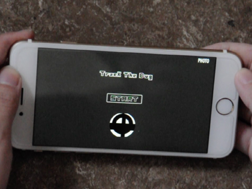

# TrackBug iOS Game

An iOS game where people have to kill the bug for the programming beginner. A code snippet that throws a certain error. The users have to track the bug to continue to the next level. 

This project is worked on by Wenbo Liu. Concept based on  
Section II: Labels and Particle Systems from iOS Games by Tutorials
By the raywenderlich.com Tutorial Team and Fruit ninja

I've also made a demo video to explain in an overview what the game is about.

## Dependence:

- SpriteKit FrameWorks
- Helper classes from raywenderlich.com

## Version:

- Xcode 7
- iPhone 6s
- iOS 9

## To do:

- Database
- More levels
- Support more languages
